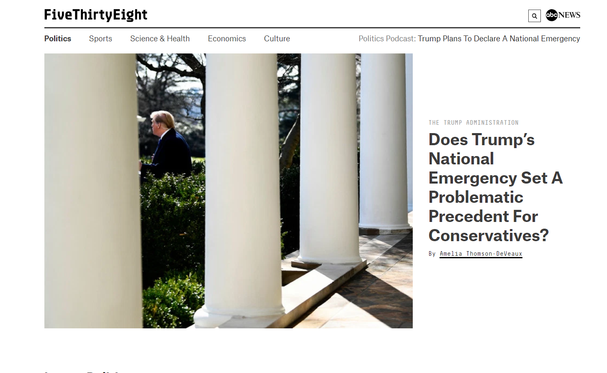
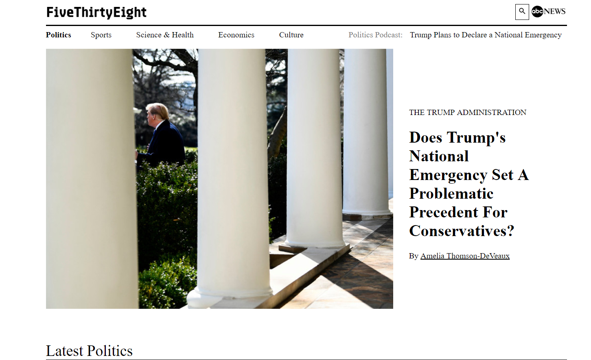

# FiveThirtyEight Politics - Site Clone

#### An effort to replicate the FiveThirtyEight Politics website as closely as possible, all the way down to its media responsiveness when changed in size to match that of an iPad or mobile phone.

#### By **Ian Cook Westgate**

## Description

A website created with HTML, CSS, and SASS where a user can view how the clone compares with the actual FiveThirtyEight Politics website. The user can change the window from the largest to smallest size in order to see how the site reorganizes its elements to meet the needs of different viewports.

### Specs

Spec: The site replicates as closely as possible the front page of FiveThirtyEight Politics, at maximum size, as it existed at the time of the work.
  - Original: 
  - Clone: 

Spec:

Spec:

## Setup/Installation Requirements

1. Clone this repository @ https://github.com/iwestgate931/fivethirtyeight-clone.git
2. Use a terminal of your choice (I use Git Bash) to access the webpage and its files by inputting: "git clone {the above clone link}"
3. Open the folder you receive and open the index.html link in the web browser of your choice (I use Google Chrome).

Alternatively, click this gh-pages link to view it directly in the web browser of your choice: https://iwestgate931.github.io/fivethirtyeight-clone/

## Known Bugs
* No known bugs at this time.

## Technologies Used
* HTML
* CSS
  * SASS

## Support and contact details

_Email iwestgate@hotmail.com with any questions, comments, or concerns._

## License

*{This software is licensed under the MIT license}*
Copyright (c) 2019 **_{Ian Cook Westgate}_**
