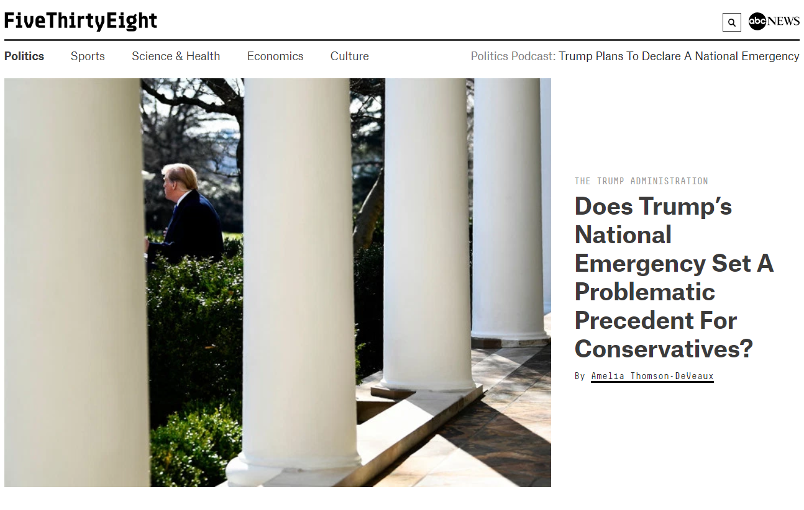

# FiveThirtyEight Politics - Site Clone

#### An effort to replicate the FiveThirtyEight Politics website as closely as possible, all the way down to its media responsiveness when changed in size to match that of an iPad or mobile phone.

#### By **Ian Cook Westgate**

## Description

A website created with HTML, CSS, and SASS where a user can view how the clone compares with the actual FiveThirtyEight Politics website. The user can change the window from the largest to smallest size in order to see how the site reorganizes its elements to meet the needs of different viewports. The site currently has no other functionality.

### Specs

Spec: The site replicates as closely as possible the front page of FiveThirtyEight Politics, at maximum size, as it existed at the time of the work.
  - Original: 
  - Clone: 
  - Original scrolled down: 
  - Clone scrolled down: 

Spec: When the site viewport is decreased in size to 768 pixels in width, the "Politics Podcast" section disappears and the remainder of the bottom navbar snaps into where it used to be. All other elements remain. The site continues to replicate the front page of FiveThirtyEight Politics as closely as possible.
  - Original pre-768px width: 
  - Clone pre-768px width: 
  - Original post-768px width: 
  - Clone post-768px width: 

Spec: When the site viewport is decreased in size to 425 pixels in width, a number of elements change: The ABC Logo is replaced by a previously hidden menu, the padding of the HTML is slightly adjusted, the remainder of the bottom navbar is removed, the central banner section is changed from a row to a column to fit the viewport, the interactives bar that was previously on the right (below "Latest Politics") disappears, and the images on the left (below "Latest Politics") shrink down in size. All other elements remain. The site continues to replicate the front page of FiveThirtyEight Politics as closely as possible.
  - Original pre-425px width: 
  - Clone pre-425px width: 
  - Original pre-425px scrolled down: 
  - Clone pre-425px scrolled down: 
  - Original post-425px width: 
  - Clone post-425px width: 
  - Original post-425px scrolled down: 
  - Clone post-425px scrolled down: 

## Setup/Installation Requirements

1. Clone this repository @ https://github.com/iwestgate931/fivethirtyeight-clone.git
2. Use a terminal of your choice (I use Git Bash) to access the webpage and its files by inputting: "git clone {the above clone link}"
3. Open the folder you receive and open the index.html link in the web browser of your choice (I use Google Chrome).

Alternatively, click this gh-pages link to view it directly in the web browser of your choice: https://iwestgate931.github.io/fivethirtyeight-clone/

## Known Bugs
* No known bugs at this time.

## Technologies Used
* HTML
* CSS
  * SASS

## Support and contact details

_Email iwestgate@hotmail.com with any questions, comments, or concerns._

## License

*{This software is licensed under the MIT license}*
Copyright (c) 2019 **_{Ian Cook Westgate}_**
